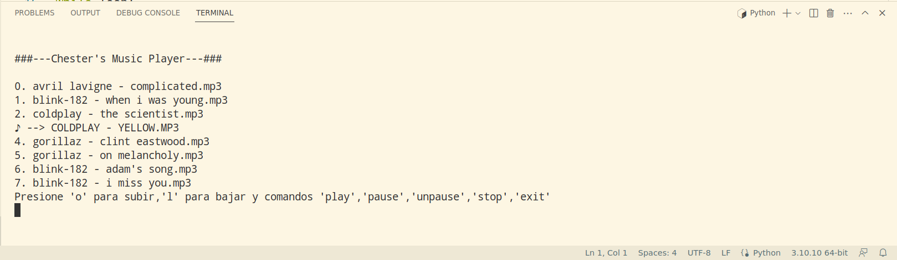

<h1 align='center'> MusicPlayerInPython </h1>

This is my second project created in python, it is a music player which runs only in terminal, it has an interactive menu to choose a song and you can make next, prev, play, stop, and pause using words or a combination of keyboards.

<pre>requirements:
python 3.10 or higher
pip install pygame </pre>

